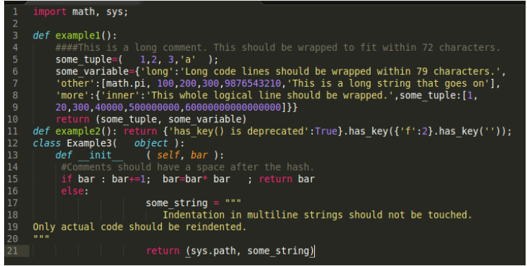
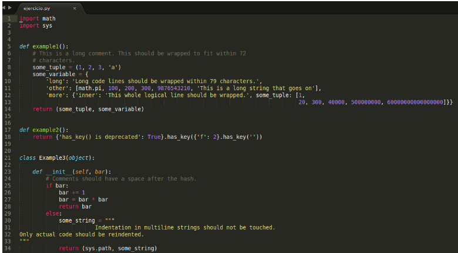

# 11 Pretty Printers: Autopep8

Como se mencionó en el tema anterior cumplir o adoptar un estándar de codificación beneficia a todos los desarrolladores y los problemas que podría ocasionar no seguir ningun estandar.
Python cuenta con la librería Autopep8 colaborando con pep8 que indica cuáles líneas de código necesitan darse formato, Autopep8 soluciona estos errores de estándar de codificación y los corrige automáticamente.
En otras palabras pep8 encuentra las líneas que necesitan ser corregidas y Autopep8 las corrige automáticamente, ahorrando al desarrollador tiempo en corregir línea por línea.

¿Cómo se usa?

Instalar desde consola

    `sudo pip install autopep8`

Realizar la corrección del código según el estándar de python

    `autopep8 --in-place nombre_del_archivo.py`

__Ejemplo:__

A continuación se muestra un fragmento de código en el cual aplicamos autopep8 para dar formato con el estándar de código de Python.

Después de aplicar autopep8 este es el resultado:

