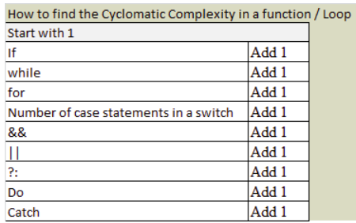

# 15 Complejidad Ciclomática

Existen múltiples métricas que de manera predictiva nos ayudan a detectar áreas de nuestro código en las cuales se presentarán defectos. Una de estas es la Complejidad Ciclomática. La cual se define formalmente como  “CC = Número de condiciones + 1”. 
Esta fórmula fue propuesta por McCabe como una forma simplificada y práctica para calcular la complejidad.

Con base a esta métrica podemos decidir qué funciones y métodos son los más propensos a tener defectos. En la siguiente tabla () se evalúan los riesgos dependiendo de la cantidad  complejidad ciclomática.

| Complejidad Ciclomática | Evaluación de riesgos |
| :----------- | -----------: |
| 1 - 10 | Programa Simple, sin mucho riesgo |
| 11 - 20 | Más complejo, riesgo moderado |
| 21 - 50 | Complejo, Programa de alto riesgo |
| 51 o más | programa muy complejo, Muy alto riesgo |

Tabla () Evaluación del riesgo según la complejidad ciclomática encontrada en un sistema.

__¿Cómo se calcula?__

__Ejercicio:__

* Aplicar la siguiente instrucción al servidor Jenkins:
	--max-complexity=2 .

* Este comando permite que el sistema que estamos integrando al servidor tenga una complejidad ciclomática de “2”, la cantidad de complejidad puede cambiar dependiendo de lo que se quiera. Ejemplo:
	--max-complexity=1 .
