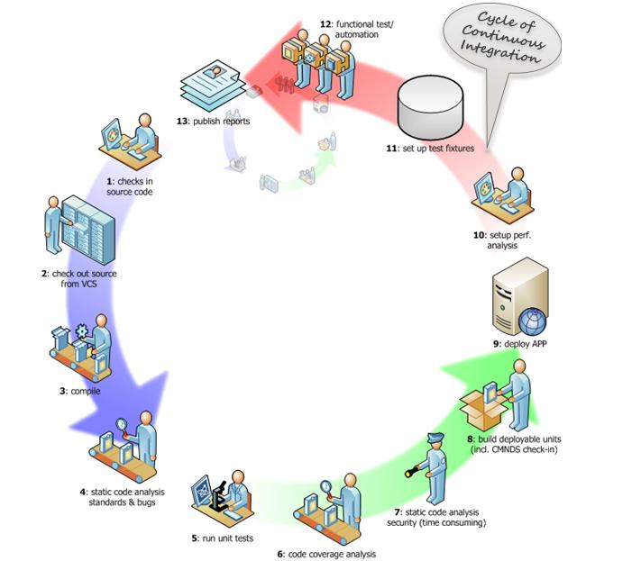

# 2 Continuous Integration
Uno de los conflictos que se presentan al no realizar integraciones continuas a los proyectos, es quebrar el sistema al integrar cambios que aún no son probados, la falta de integración continua genera inestabilidad en el código además de un ciclo de retroalimentación muy largo, por mencionar algunos.
Realizar integraciones continuas consiste en hacer integraciones “automáticas” de un proyecto frecuentemente para detectar fallos en el sistema lo antes posible, esto se refiere a la compilación y ejecución de pruebas de todo un proyecto.

A continuación se mencionan algunas de las ventajas y desventajas de realizar Continuos Integration (Tabla 1).

| Ventajas                                      |                     Desventajas                       |
| :-------                                      |                      ------:                          |
|Detectar y solucionar problemas de integración |                                                       |
| de forma continua.                            |Requiere compromiso de la empresa (infraestructura).   |
|Disponibilidad constante de una versión para   |Mantenimiento de alto nivel.                           |
| pruebas.                                      |                                                       |
|Ejecución inmediata de las pruebas unitarias.  |Un experto para el manejo (Build master)               |
|Monitorización continua de las métricas de     |                                                       |
|calidad del proyecto.                          |                                                       |

Tabla 1: Ventajas y desventajas de continuous integration

Ciclo de vida:

1. Checks in source code.
2. Checks out source from VCS.
3. Compile.
4. Static code analysis standards & bugs.
5. Run unit test.
6. Code coverage analysis.
7. Static code analysis security (time consuming).
8. build deployable units.
9. Deploy APP.
10. Setup perf analysis.
11. Set up test fixtures.
12. Functional test / automation.
13. Publish reports.

A continuación se nombran algunas de las herramientas que se pueden utilizar:

* GitHub. Repositorio para control de versiones
* Travis-CI. Sistema distribuido de integración continua libre integrado con GitHub
* CPD (Continuing Professional Development)
* PMD (Project Mess Detector)
* Coverity. 
* FxCop. Herramienta de análisis de código
* Jenkins. Servidor de integración continua open source
