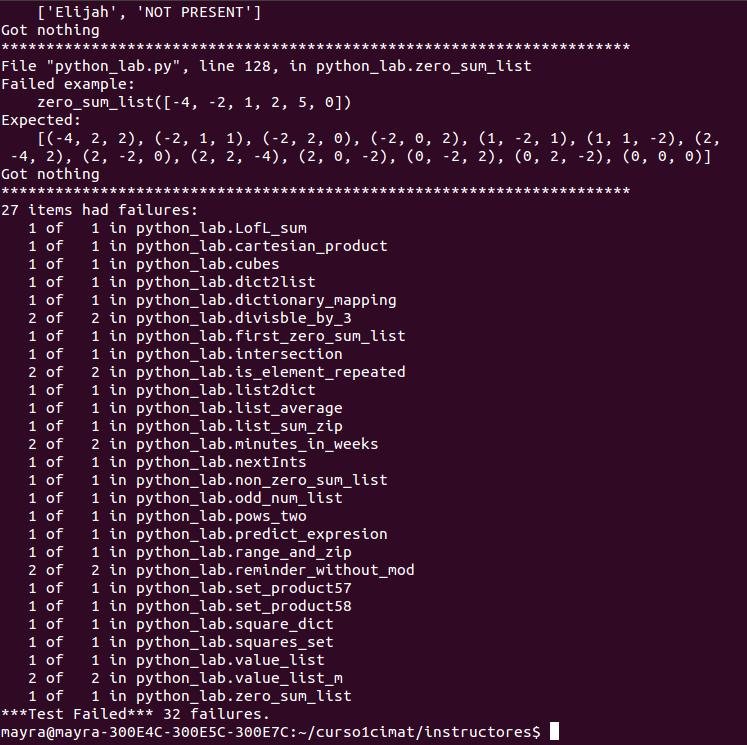

# Doctest: Ejercicio

La falta de pruebas durante el desarrollo de Software genera caos por la innumerable cantidad de errores o fallas que puede tener un sistema, programa o aplicación, sólo al realizar las pruebas salen a relucir estos errores, pero probado está, que entre más tarde se encuentre un error, más costoso es corregirlo.

__Doctest:__ es un módulo que incluye python que permite la realización de pruebas unitarias basada en la salida estándar que se obtienen en la shell, como parte de la documentación de una función y método se puede escribir directamente el caso de prueba.

En la siguientes imágenes podemos ver un ejemplo de cómo se realizan las pruebas “Doctest”.

__TDD (Test Driven Development).__ Consiste en el desarrollo de dos prácticas: escribir las __pruebas antes del código y refactorización.__ Se toma un requerimiento y se desarrolla una prueba, pensando en cómo debería ser la funcionalidad del método y verificar que ésta falle. A Continuación se desarrolla el código de la prueba y se verifica que la prueba pase satisfactoriamente, hecho esto, se procede a realizar refactorización para mejorar la funcionalidad del código. Con esto se verifica que el código está cumpliendo con los requisitos mediante la realización de las pruebas. Existen herramientas que nos ayudan ejecutar pruebas automatizadas como JUnit.

En la siguiente tabla se mencionan los comandos y su descripción que se utilizaran para verificar la funcionalidad de las pruebas que se desarrollaran en el ejercicio sobre “Doctest”.

| Definición | Comando   |
| :----------| --------: |
|Correr las pruebas | python -m doctest python_lab.py |
|Abrir el archivo para editar | nano nombre del archivo |

Tabla: Comandos para ejecutar el archivo de pruebas unitarias

__Ejercicio:__ En el repositorio de código se encuentra el archivo con el nombre “python_lab.py” con pruebas unitarias, guardar el alchivo en la carpeta del curso. estas pruebas no están funcionando correctamente. Realizar las correcciones para que las pruebas puedan funcionar correctamente. Utiliza el comando “python -m doctest python_lab.py” para correr las pruebasy verificar cuales estan correctas y cuales no. 
En la siguiente imagen se muestra el funcionamieto de “python -m doctest python_lab.py”

__Nota:__ Para conocer al desarrollador de cada linea de codigo ejecutar el siguiente comando:

    `git blem nombre_del_archivo`
    `git blem python_lab.py`

