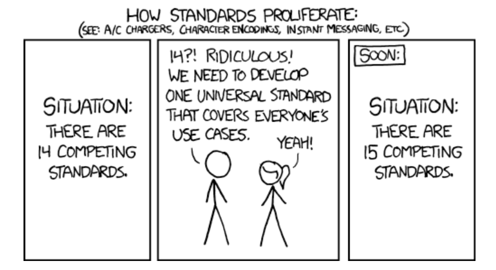
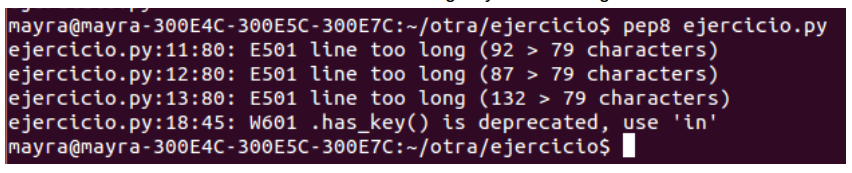

# 10 Estándar de código

La falta de establecimiento de un estándar de código hace que sea difícil dar mantenimiento, esto complica el entendimiento de un sistema para la persona que no lo programó, disminuye la calidad del mismo. La programación con diferentes estándares de codificación en un mismo equipo de desarrollo crea conflictos a la hora de subir los cambios al repositorio.
El estándar de codificación brinda calidad a nuestro código por lo cual es importante, sea cual sea el lenguaje de programación en el que se esté acostumbrado a programar,  para todos los lenguajes de programación existe un estándar de código que se puede adoptar.
Si se está desarrollando de forma colaborativa, todos los desarrolladores deben adoptar el mismo estándar de código con lo cual, debe parecer que el mismo desarrollador codificó todo el programa. Con un estándar de código facilitaremos el mantenimiento del mismo, añadir nuevas características, modificar las ya existentes, depurar errores, o mejorar el rendimiento. 

Por citar algunos ejemplos se mencionan los siguientes:

__Identación.__ Usa 4 espacios por cada nivel de indentación.

__¿Tabuladores o espacios?.__ Nunca mezcles tabuladores y espacios.

__Tamaño máximo de línea.__ Limita todas las líneas a un máximo de 79 caracteres.

__No usar espacios alrededor del signo.__ Igual cuando se encuentre en un listado de argumentos de una función:

* Incorrecto:
	def suma(a=0, b=0):
* Correcto:
	def suma(a = 0, b = 0):
No se deben de realizar comentarios obvios.

Puedes encontrar mas información sobre el estandar de código [aquí][15] 
[15]:http://mundogeek.net/traducciones/guia-estilo-python.htm)

## 10.1 Para Python encontramos PEP8 (Python Enhancement Proposals).

Está dedicada a la recopilación de los estándares seguidos por los desarrolladores de Python a la hora de escribir código para la librería estándar, éste ejecuta las reglas automáticamente y genera un resultado de las líneas que no cumplen con el estándar de codificación.

__Instalación__

    `sudo pip install flake8`

Actualización

    `pip install --upgrade`

¿Cómo se usa?

Al ejecutar los siguientes comandos se mostraran las violaciones que estan presentes en el estandar de codigo definido por Python.

    `flake8 Nombre del archivo.py`
               ó
    `pep8 nombre del archivo.py`

Donde mostrará las violaciones al estándar de código Python de la siguiente manera:

    `pep8 ejercicio.py`

El siguiente comando cuenta las líneas que hay con error:

    `flake8 python_lab.py | wc -l`

