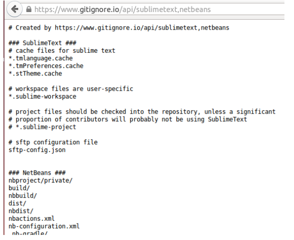

# 19 Gitignore

Frecuentemente necesitamos que repositorios de código ignoren archivos temporales que nuestras herramientas de desarrollo producen. Para ello se utiliza .gitignore.

En este archivo vamos a colocar las extensiones de los archivos que queremos que sean ignorados.

Un buen lugar para empezar sería generar el archivo “.gitignore” [aquí][8]
[8]:https://www.gitignore.io/

 

Simplemente escribe el nombre de las herramientas de desarrollo que usan en tu equipo de trabajo. Por ejemplo si alguien utiliza SublimeText y otra persona utiliza NetBeans usarán esas instrucciones.

Se generará un archivo como el siguiente:

Con el archivo de gitignore.io actualiza el archivo .gitignore en tu repositorio de código, una sola persona del equipo realizara commit y push para guardar los cambios. 

Todos los miembros del equipo deberán realizar pull para mantener su repositorio local actualizado.
Por último necesitas decirle a git que “olvide” los archivos “basura” que ya tenga guardados.

Para ello sigue las instrucciones que encontraras [aquí][9]
[9]:http://stackoverflow.com/a/19095988/54848

