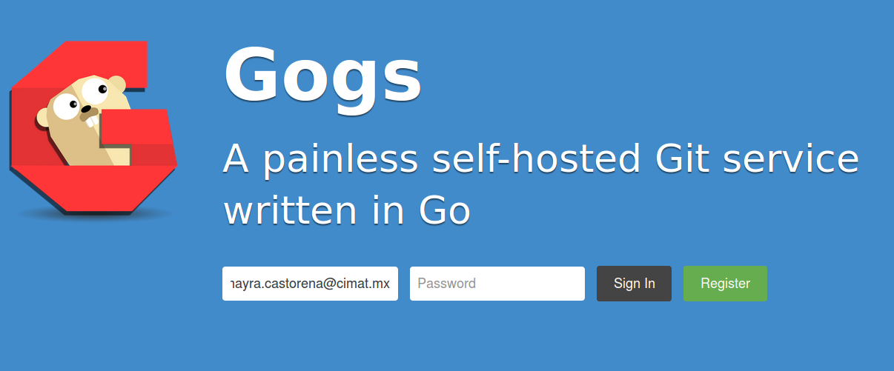
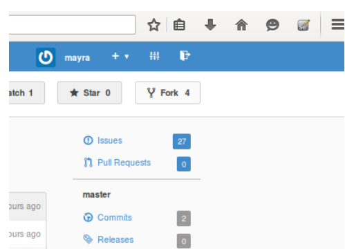
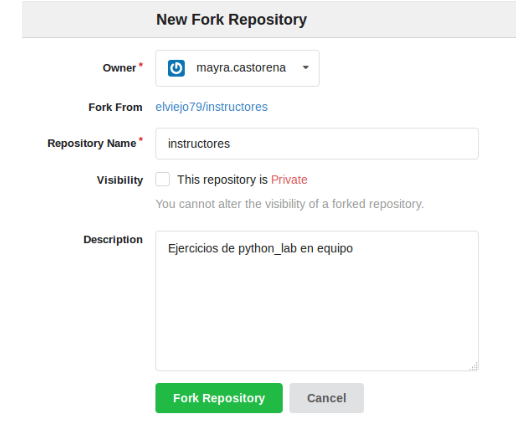
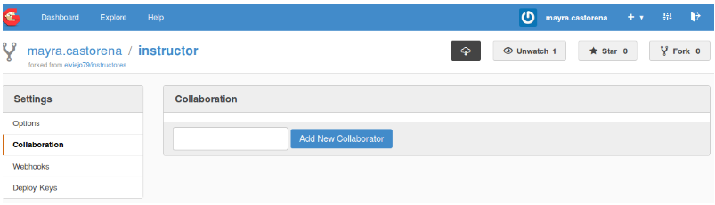
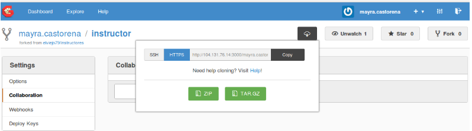
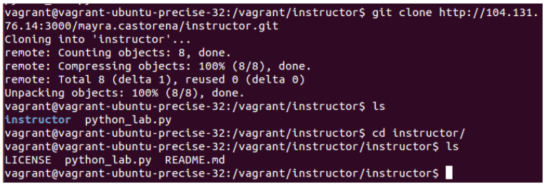
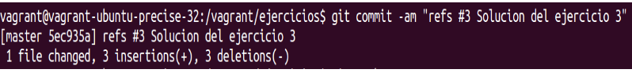
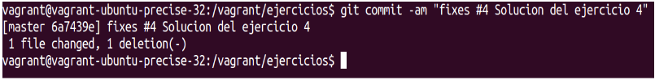

# 9 Introducción a Gogs

La administración de un repositorio de código  no es una tarea sencilla de realizar desde consola, como una solución a este problema existe una aplicación Web llamada Gogs (Go Git Service) cuyo objetivo es proporcionar un servicio para la gestión de proyectos en Git (similar a GitHub o GitLab) para servidores propios de manera más fácil, más rápida y con el menor esfuerzo posible. Esto es posible gracias a una distribución binaria e independiente de la aplicación escrita en Go que funciona en todas las plataformas soportadas por el lenguaje, incluyendo Linux, Mac OS X y Windows.
Con Gogs podemos controlar Tickets, y administrar los archivos que necesitamos en nuestro proyecto así como contar con el historial de tickets.

¿Cómo se usa?

__Ejercicio:__ El siguiente ejercicio se realizará mediante el repositorio Gogs, la interfaz es la que se puede observar a continuación:

Pasos generales para el desarrollo del ejercicio (no son pasos específicos)

* Entrar a la url que te dirá el instructor, ejemplo: http://10.13.4.78:3000/
* Registrarse
* Reunirse en equipo, seleccionar un líder y nombre del equipo
* Solo el líder,  creará un repositorio, haciendo clic en Fork, al actual (Creado por el instructor).

* En “Repository Name” asignar un nombre al nuevo repositorio (podría ser el nombre del equipo).

* Agregar a sus compañeros de equipo como colaboradores.

* Todo el equipo hace un clon del repositorio en Vagrant desde la máquina virtual después de que el líder haya hecho el Fork.
* Copiar la url del repositorio desde Gogs.

* Desde la consola entrar a /vagrant y ejecutar el comando:

 git clone pegar aqui la url del repositorio que fue copiado previamente

* En equipo organizarse para seguir realizando los ejercicios que se comenzaron en el tema “Doctest” de forma colaborativa con el repositorio Gogs.

* Cada uno de los integrantes deberá hacer commit, push y pull para actualizar el repositorio de código.

* Para hacer referencia a los “issue” que están el Gogs, cada miembro del equipo deberá colocar “Refs #numero_de_issue_al_cual_se_refiere" dentro del comentario, para poder hacer referencia de la prueba al “issue” como se muestra de ejemplo en la siguiente pantalla:

* Para cerrar el “issue” se cambiará el comando por: “fixes #3” como se muestra en la siguiente imagen:

__NOTA:__ Los comandos son los mismos que se encuentran en el tema “Repositorio de código Git”.
