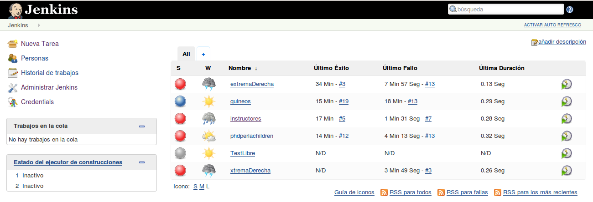
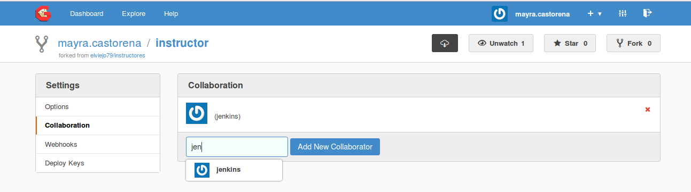
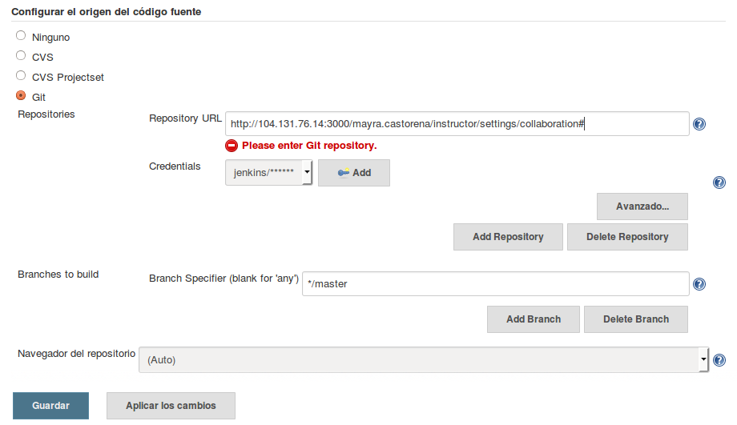
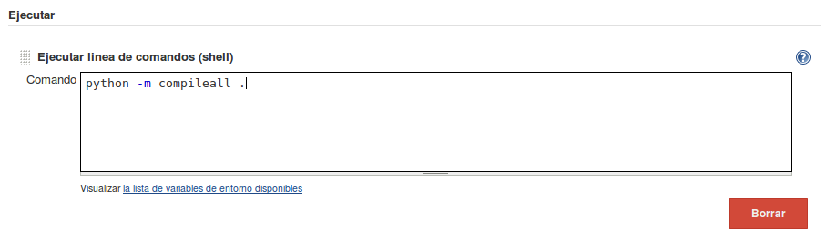
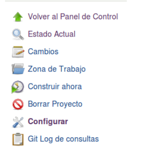

# 12 Introducción a Jenkins

Herramienta de integración continua Open Source para el desarrollo de Software.
Se encuentra en ejecución en un servidor que es un contenedor de servlets, como Apache Tomcat. Soporta herramientas de control de versiones como CVS, Subversion, Git, Mercurial, Perforce, Clearcase y puede ejecutar proyectos basados en Apache Ant y Apache Maven, así como scripts de shell y programas batch de Windows.

¿Cómo se usa?

Jenkins permite configurar el tiempo de ejecución de las pruebas de integración, así como correr pep8 para la verificación del estándar de código, entre algunas otras funciones.

__Nota:__ Es mala idea integrar el comando de autopep8 (que se encarga de la corrección del estándar de código de python) ya que se recomienda realizar estas correcciones antes de enviar cambios al servidor.

__Ejercicio:__ Con ayuda del instructor configurar el servidor Jenkins.

* Desde Gogs, el líder del equipo añade un colaborador llamado “Jenkins”.

* Desde Jenkins, seleccionar configuraciones y añadir en “Credentials” a Jenkins para que tenga permisos.

* En “Build triggers” indicar cada cuanto tiempo se realizará la actualización

Formato para realizar las pruebas en un periodo de tiempo.

|Formato | Cada cuanto | Ejemplo | Descripcion |
|:-----: | :---------: | :-------: | :---------:|
| *      |Cada minuto | H/5****   | Cada 5 minutos |
| **     | Cada hora |           |             |
| ***    | Cada mes   |           |            |
| *****  | Cada día   | * *  * *0 | Cada minuto, cada hora, cada mes, de todos los domingos. |
|        |            | * * * * 0,1 | Cada minuto, cada hora, cada mes, de todos los domingos y lunes. |

En el campo “Execute shell” podemos agregar comandos que se quieren ejecutar cada determinado tiempo solo si el servidor encontró cambios, e incluso se puede indicar el directorio en la cual se desea la ejecución del comando.

* En el campo “Execute shell” agregar el siguiente comando para que lo ejecute el servidor de manera automática:

	python -m compileall .
 
Este comando compila todo el código a partir de esta carpeta

* Dar clic en “Build now” o “Construir ahora” y observa lo que sucede.

* Añadir un nuevo comando al campo “Execute shell” Este comando nos indica si violamos el estándar de código. Para este caso asignamos un máximo de 160 caracteres por línea de código.

	flake8  --max-line-length=160 .

* Dar clic en “Build now” o “Construir ahora” y observa si tus resultados son satisfactorios.

