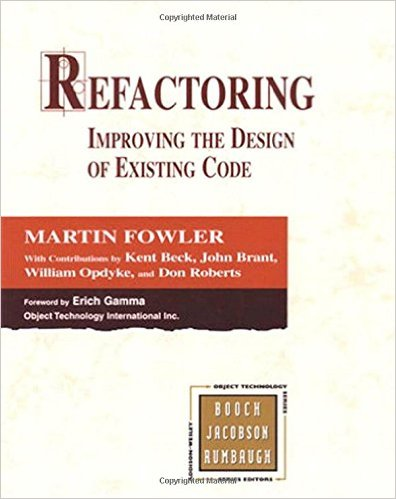

# 16 Refactoring

El término refactoring se refiere a una transformación del código que no afecta la funcionalidad externa del sistema para mejorar la facilidad de comprensión o cambiar su estructura y diseño, con la finalidad de facilitar el mantenimiento en el futuro.

Martin Fowler nos presenta en su libro “Refactoring: Improving the Design of Existing Code”, una excelente guía para aprender más sobre este concepto. 
REFACTORING: IMPROVING THE DESIGN OF EXISTING CODE
Por: MARTIN FOWLER , ADDISON-WESLEY, 1999
ISBN: 9780201485677

Datos del libro
* Nº de páginas: 320 págs.
* Encuadernación: Tapa blanda
* Editorial: ADDISON-WESLEY
* Lengua: INGLÉS
* ISBN: 9780201485677

Uno de los conceptos que se presentan en este libro es Code Smell, este concepto se refiere a distintos tipos de errores de diseño que debemos evitar al momento de programar. En la siguiente tabla se muestra un catálogo de algunos de los Code Smells más sobresalientes. 

| Smell | Refactoring |
| Comments. When you feel like writing a comment, first try "to refactor so that the comment becomes superfluous" | Rename Method 
Extract Method 
Introduce Assertion |
| | |

