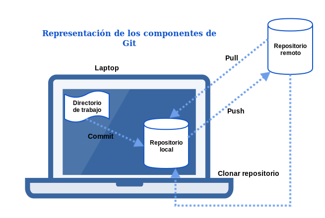
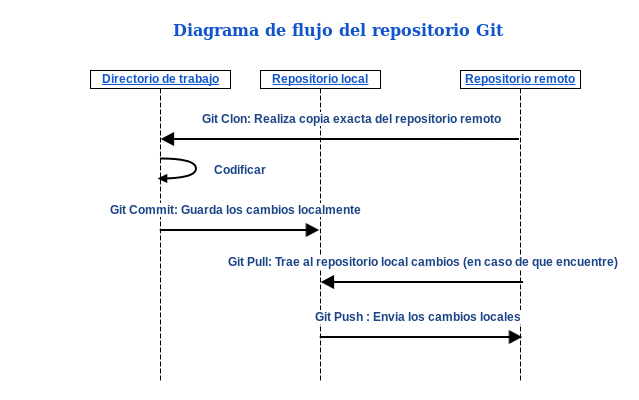

# 8 Repositorio de código Git

Cuando se trabaja en un proyecto de desarrollo de software, ya sea individualmente, siendo parte de un equipo de trabajo o de manera distribuida, pueden generarse problemas si no se cuenta con un repositorio de código dónde se encuentren versiones del mismo. Por ejemplo, si dos o más personas están trabajando en el mismo archivo podría generarse perdida de código al realizar las actualizaciones al archivo, si se está trabajando sin repositorio y toda la información se encuentra solo en una carpeta en una máquina personal, y por error se elimina sin contar con algún respaldo actualizado, se daría una pérdida completa del proyecto generando un grave problema para el desarrollador y para todo el equipo.

El repositorio de código ayuda a que el proyecto se encuentre ubicado en un lugar seguro, además se puede tener un control de las versiones, cambios realizados, fechas de modificación, fechas de última versión, el nombre del integrante que modificó el código; en caso de que hubiera un error en alguna versión y fuera encontrado durante producción, se puede tomar una versión anterior que no tenga errores y que no haya sufrido cambios significativos y utilizarla. A continuación se aprenderá a utilizar este tipo de repositorios de código.

¿Cómo funciona Git?

La siguiente imagen muestra los componentes básicos para comprender Git.

A continuación se muestra un diagrama con el flujo del funcionamiento de Git.

__Comandos más utilizados__

| Descripción                                      |                     Comandos                       |
| :-------                                      |                      -------------------------------: |
| Para bajar por primera vez lo que se encuentra | git clone username@host:/path/to/repository          |
| en un repositorio remoto.                       |                                                     |
| Bajar cambios del repositorio local | git pull |                                                     |
| Subir cambios al repositorio Git | git push |                                                         |
| Registrar cambios | git add nombre del archivo |                                                       |
| Realizar un comentario al subir cambios           |                       git commit -am “comentario” |
| Crea una copia local del repositorio de código  |                git clone <http://path/to/repository> |
| Hacer commit agregando el número de tiquet y la palabra                                                |
| reservada para que tome al tiquet como cerrado  |         git commit -am "fixes #12 header and footer" |
| Con “refs” se hace referencia al tiquet #12    |           git commit -am "refs #12 header and footer" |

Existen muchos repositorios de código, uno de los más utilizados es Git. En la siguiente liga se puede encontrar un pequeño manual que ayudará a comprender el funcionamiento de Git [aquí][4] 

[4]:https://try.github.io/levels/1/challenges/1

## 8.1 instalacion de Git

### 8.1.1 Instalacion de Git en MAC OS 

Deberá tener instalado Homebrew

    `brew update`
    `brew install git`

### 8.1.2 Instalacion de Git en Debian/Ubuntu

    `sudo apt-get update`
    `sudo apt-get install git`

### 8.1.3 Instalacion de Git en Windows

Descargar Git [aquí][5] y ejecutarlo

[5]:https://git-scm.com/download/win

