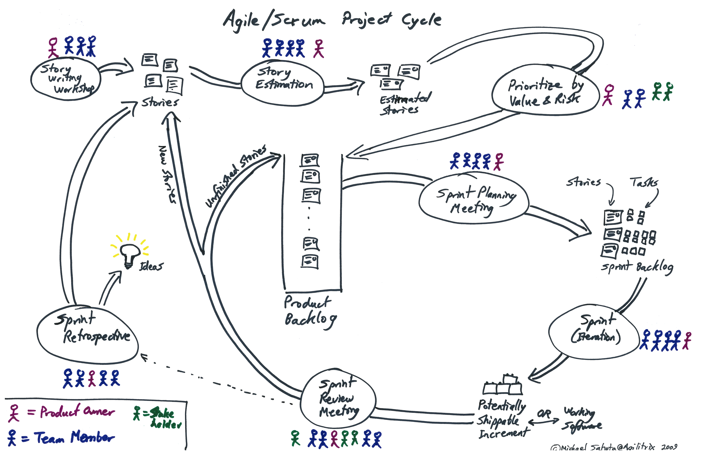

# 1 ScrumBut

La siguiente imagen muestra el ciclo de vida del marco de trabajo conocido como SCRUM.
Se dará un repaso para recordar el ciclo de vida.

Los principales elementos de la metodología SCRUM son lo siguientes:

	* El Equipo Scrum
		* El propietario del producto (Product Owner)
		* El Equipo de Desarrollo (Developers)
		* El Scrum Master
	* Eventos de SCRUM
		* La iteración (Sprint)
		* Planificación de la iteración (Sprint Planning)
		* Reunión diaria de SCRUM (Daily Scrum)
		* Revisión de la iteración (Sprint Review)
		* Retrospectiva del Sprint (Sprint)
	* Artefactos de Scrum
		* Product Backlog
		* Sprint Backlog
		* Incremento
	* Transparencia de Artefacto
		* Definición de "Hecho” (Done)

ScrumButs se refiere a las razones por las cuales el equipo no puede sacar el máximo provecho de SCRUM para resolver sus problemas y hacer realidad los beneficios de desarrollo de productos utilizando Scrum.

 	* "Nosotros utilizamos Scrum, pero...¿Quien tiene un Daily Scrum todos los días? es demasiado!. Tan sólo tenemos uno por semana."

 	* "Nosotros utilizamos Scrum, pero... Las retrospectivas son una pérdida de tiempo. Por lo que no hacemos."

 	* "Nosotros utilizamos Scrum, pero... No podemos construir una pieza de funcionalidad en un mes. Nuestros Sprints son 6 semanas de duración."

 	* "Nosotros utilizamos Scrum, pero... A veces nuestros gerentes nos dan tareas especiales. Por lo que no siempre tenemos tiempo para cumplir con nuestra definición de done."

	** ¿Vale la pena utilizar SCRUM? **
Segun los indicadores de una encuasta realizada en el 2012, el 86% de los proyectos son cambiados o son un fracaso

El métdo de cascada es un malentendido desde el principio.
Fue supuestamente "inventado" por el diario "Gestion de desarrollo de sistemas de Software grandes" por el Dr. Winston W. Royce en 1970, pero la implementacion que se ha descrito anteriormente es riesgoso e invita al fracaso.

	** Discrepancia entre el modelo y el problema **

¿Es un bebé una versión más pequeña de un adulto?, la respuesta es no, ya que un bebé no es un adulto pequeño, un bebé es un ser independiente. Por lo tanto creer que un bebé es un adulto en forma pequeña o de menor tamaño es algo erróneo.
Las empresas como la NASA, IBM del departamento de la defensa crearon sus propios modelos de calidad como CMM para sus empresas, las cuales, están constituidas por un gran equipo de trabajo, manejan al rededor de 800 mil trabajadores, por lo cual se caraloga como una empresa grande, al igual que IBM.

Entonces, ¿porqué se pretende adaptar procesos que fueron desarrollados para manejar grandes empresas, quieren ser adaptados a empresas de nuesto país, empresas pequeñas y medianas, las cuales no cuentan ni con la mitad de los trabajadores pertenecientes a las ya mencionadas?, es lo mismo que creer que un bebé es un adulto pequeño.
Las empresas en México necesitan adaptar procesos a sus necesidades y no las "empresas a los procesos".

